## Flip - 前后端分离式论坛系统

   

### ✍️ &nbsp;项目描述

Flip 是一款前后端分离的论坛系统，旨在为用户提供一个交流和分享信息的平台。（admin的密码：1Qq.....）

### 🤌 &nbsp;项目涉及的技术内容

- 前端技术栈：Vue.js，Element Plus，Vue Router，Axios，Pinia 等，构建工具为 Vite。
- 后端技术栈：Spring Boot，Spring Security，MyBatis，MyBatis Plus，Spring Mail 等，构建工具为 Maven。
- 中间件：Redis，ElasticSearch 等，后续会引入 RabbitMQ。
- 数据库：MySQL 8.0。

### ✅ &nbsp;已实现功能

- [x] 用户的登录与注册，使用 Spring Security 完成。
- [x] 富文本编辑器，引入开源的 Vditor。
- [x] 发布、编辑和浏览帖子。
- [x] 标签和分类。
- [x] 评论与回复。评论采用层级形式，回复采用楼中楼形式。
- [x] 用户个人中心，支持头像修改和头像文件的裁剪。
- [x] 账号设置。
- [x] 后台管理。
- [x] 搜索。
- [x] 敏感词过滤。
- [x] 移动端适配，响应式布局。

### ❎ &nbsp;待完成功能

- [ ] 权限管理可视化操作。
- [ ] 引入消息队列优化系统性能。
- [ ] 更多待添加....

### 📘 &nbsp;文件结构树

```angular2html
├── src
│   ├── main
│   │   ├── java
│   │   │   └── com
│   │   │       └── flip
│   │   │           ├── FlipBackApplication.java
│   │   │           ├── annotation
│   │   │           │   └── LimitRequest.java
│   │   │           ├── aspect
│   │   │           │   └── LimitRequestAspect.java
│   │   │           ├── config
│   │   │           │   ├── CorsConfig.java
│   │   │           │   ├── ElasticConfig.java
│   │   │           │   ├── MybatisPlusConfig.java
│   │   │           │   ├── ObjectMapperConfig.java
│   │   │           │   ├── RedisConfig.java
│   │   │           │   ├── SecurityConfig.java
│   │   │           │   └── WebConfig.java
│   │   │           ├── controller
│   │   │           │   ├── admin
│   │   │           │   │   ├── SensitiveController.java
│   │   │           │   │   ├── StatusController.java
│   │   │           │   │   ├── TagController.java
│   │   │           │   │   └── UserSysController.java
│   │   │           │   └── common
│   │   │           │       ├── AccountController.java
│   │   │           │       ├── CommentController.java
│   │   │           │       ├── PostController.java
│   │   │           │       ├── SearchController.java
│   │   │           │       ├── TestController.java
│   │   │           │       └── UserController.java
│   │   │           ├── domain
│   │   │           │   └── Response.java
│   │   │           ├── entity
│   │   │           │   ├── Authority.java
│   │   │           │   ├── Comment.java
│   │   │           │   ├── Post.java
│   │   │           │   ├── PostTag.java
│   │   │           │   ├── Role.java
│   │   │           │   ├── SensitiveWord.java
│   │   │           │   ├── Tag.java
│   │   │           │   ├── TagOption.java
│   │   │           │   ├── User.java
│   │   │           │   ├── dto
│   │   │           │   │   └── LoggedUser.java
│   │   │           │   └── vo
│   │   │           │       ├── BannedHistory.java
│   │   │           │       └── BannedUser.java
│   │   │           ├── exception
│   │   │           │   └── InvalidTokenException.java
│   │   │           ├── filter
│   │   │           │   └── JwtAuthenticationFilter.java
│   │   │           ├── handler
│   │   │           │   ├── AutoFillHandler.java
│   │   │           │   ├── GlobalExceptionHandler.java
│   │   │           │   └── login
│   │   │           │       ├── LogoutHandler.java
│   │   │           │       ├── LogoutSuccessHandlerImpl.java
│   │   │           │       ├── NoLoginHandler.java
│   │   │           │       └── NoPermissionHandler.java
│   │   │           ├── mapper
│   │   │           │   ├── AuthorityMapper.java
│   │   │           │   ├── BannedUserMapper.java
│   │   │           │   ├── CommentMapper.java
│   │   │           │   ├── PostMapper.java
│   │   │           │   ├── PostTagMapper.java
│   │   │           │   ├── RoleMapper.java
│   │   │           │   ├── SensitiveWordMapper.java
│   │   │           │   ├── TagMapper.java
│   │   │           │   ├── TagOptionMapper.java
│   │   │           │   └── UserMapper.java
│   │   │           ├── service
│   │   │           │   ├── AccountService.java
│   │   │           │   ├── BannedUserService.java
│   │   │           │   ├── CommentService.java
│   │   │           │   ├── PostService.java
│   │   │           │   ├── SearchService.java
│   │   │           │   ├── SensitiveWordService.java
│   │   │           │   ├── TagOptionService.java
│   │   │           │   ├── TagService.java
│   │   │           │   ├── UserService.java
│   │   │           │   └── impl
│   │   │           │       ├── AccountServiceImpl.java
│   │   │           │       ├── BannedUserServiceImpl.java
│   │   │           │       ├── CommentServiceImpl.java
│   │   │           │       ├── PostServiceImpl.java
│   │   │           │       ├── SearchServiceImpl.java
│   │   │           │       ├── SensitiveWordServiceImpl.java
│   │   │           │       ├── TagOptionServiceImpl.java
│   │   │           │       ├── TagServiceImpl.java
│   │   │           │       ├── UserDetailServiceImpl.java
│   │   │           │       └── UserServiceImpl.java
│   │   │           ├── utils
│   │   │           │   ├── AddressUtils.java
│   │   │           │   ├── AvatarUtils.java
│   │   │           │   ├── IpUtils.java
│   │   │           │   ├── JwtUtils.java
│   │   │           │   ├── RedisKeyUtils.java
│   │   │           │   ├── SensitiveWordUtils.java
│   │   │           │   ├── SystemUtils.java
│   │   │           │   ├── TimeUtils.java
│   │   │           │   └── elastic
│   │   │           │       ├── ElasticPostUtils.java
│   │   │           │       ├── ElasticUserUtils.java
│   │   │           │       └── ElasticUtils.java
│   │   │           └── validation
│   │   │               └── VG.java
│   │   └── resources
│   │       ├── META-INF
│   │       │   └── MANIFEST.MF
│   │       ├── application-dev.yaml
│   │       ├── application-prod.yaml
│   │       ├── application.yaml
│   │       ├── mapper
│   │       │   ├── AuthorityMapper.xml
│   │       │   ├── BannedUserMapper.xml
│   │       │   ├── TagMapper.xml
│   │       │   ├── commentMapper.xml
│   │       │   ├── postMapper.xml
│   │       │   ├── roleMapper.xml
│   │       │   └── userMapper.xml
│   │       ├── static
│   │       └── templates
│   │           └── mail-register-template.html
│   └── test
│       └── java
│           └── com
│               └── flip
└── target
```

```angular2html
├── env
├── index.html
├── package-lock.json
├── package.json
├── public
│   ├── assets
│   │   ├── js
│   │   └── strawberry
│   │       ├── fonts
│   │       │   ├── StrawberryIcon-Free.eot
│   │       │   ├── StrawberryIcon-Free.svg
│   │       │   ├── StrawberryIcon-Free.ttf
│   │       │   └── StrawberryIcon-Free.woff
│   │       ├── selection.json
│   │       ├── style.css
│   │       ├── style.scss
│   │       └── variables.scss
│   ├── favicon.ico
│   └── html
│       └── ie.html
├── src
│   ├── App.vue
│   ├── api
│   │   ├── admin
│   │   │   ├── overviewAPI.js
│   │   │   ├── sensitiveAPI.js
│   │   │   ├── tagAPI.js
│   │   │   └── userSysAPI.js
│   │   ├── commentAPI.js
│   │   ├── loginAPI.js
│   │   ├── postAPI.js
│   │   ├── searchAPI.js
│   │   ├── testAPI.js
│   │   ├── uploadAPI.js
│   │   └── userAPI.js
│   ├── assets
│   │   ├── emoji.ts
│   │   └── styles
│   │       └── dark
│   │           └── css-vars.css
│   ├── components
│   │   ├── comment
│   │   │   ├── Comments.vue
│   │   │   ├── make
│   │   │   │   └── MakeComment.vue
│   │   │   └── replies
│   │   │       └── ShowReplies.vue
│   │   ├── cropper
│   │   │   └── AvatarCropper.vue
│   │   ├── editor
│   │   │   └── Editor.vue
│   │   ├── layout
│   │   │   ├── aside
│   │   │   │   ├── index
│   │   │   │   │   ├── CountdownAside.vue
│   │   │   │   │   ├── HotTagAside.vue
│   │   │   │   │   └── StatisticsAside.vue
│   │   │   │   └── post
│   │   │   │       └── PostAuthorAside.vue
│   │   │   ├── dialog
│   │   │   │   ├── DevelopingDialog.vue
│   │   │   │   ├── NoLoginDialog.vue
│   │   │   │   └── NoVerifyEmailDialog.vue
│   │   │   ├── footer
│   │   │   │   └── Footer.vue
│   │   │   └── header
│   │   │       ├── Header.vue
│   │   │       ├── expand
│   │   │       │   └── LeftExpandMenu.vue
│   │   │       ├── search
│   │   │       │   └── SearchBar.vue
│   │   │       └── togger
│   │   │           └── ThemeToggle.vue
│   │   ├── page
│   │   │   └── CascadePage.vue
│   │   ├── post
│   │   │   ├── Operations.vue
│   │   │   └── PostList.vue
│   │   ├── search
│   │   │   ├── SearchedPosts.vue
│   │   │   └── SearchedUsers.vue
│   │   ├── tags
│   │   └── user
│   │       ├── BanUserDialog.vue
│   │       ├── profile
│   │       │   ├── UserBookmarks.vue
│   │       │   ├── UserComments.vue
│   │       │   ├── UserFollows.vue
│   │       │   └── UserPosts.vue
│   │       └── setting
│   │           ├── UpdateAccount.vue
│   │           ├── UpdateAvatar.vue
│   │           └── UpdateProfile.vue
│   ├── directive
│   │   ├── authority
│   │   │   ├── hasAuthority.js
│   │   │   └── hasRole.js
│   │   └── index.js
│   ├── main.js
│   ├── router
│   │   └── index.js
│   ├── stores
│   │   ├── tabStore.js
│   │   ├── themeStore.js
│   │   └── userStore.js
│   ├── utils
│   │   ├── errorMsg.js
│   │   ├── permission.js
│   │   ├── request.js
│   │   ├── tags.js
│   │   └── token.js
│   └── views
│       ├── Index.vue
│       ├── about
│       │   └── About.vue
│       ├── account
│       │   ├── Activate.vue
│       │   ├── Login.vue
│       │   └── Register.vue
│       ├── admin
│       │   └── Admin.vue
│       ├── error
│       │   └── 404.vue
│       ├── main
│       │   └── Main.vue
│       ├── post
│       │   ├── view
│       │   │   └── ViewPost.vue
│       │   └── write
│       │       └── WritePost.vue
│       ├── search
│       │   └── Search.vue
│       ├── tabs
│       │   ├── admin
│       │   │   ├── AdminAuthority.vue
│       │   │   ├── AdminMail.vue
│       │   │   ├── AdminOverview.vue
│       │   │   ├── AdminSensitive.vue
│       │   │   ├── AdminTag.vue
│       │   │   └── AdminUser.vue
│       │   └── main
│       │       ├── AllPosts.vue
│       │       ├── HotPosts.vue
│       │       └── LatestPosts.vue
│       ├── tag
│       │   ├── Tag.vue
│       │   └── Tags.vue
│       └── user
│           ├── Profile.vue
│           ├── RoleTest.vue
│           └── Setting.vue
└── vite.config.js
```

### 📷 &nbsp;系统截图

####  1⃣ &nbsp;论坛首页

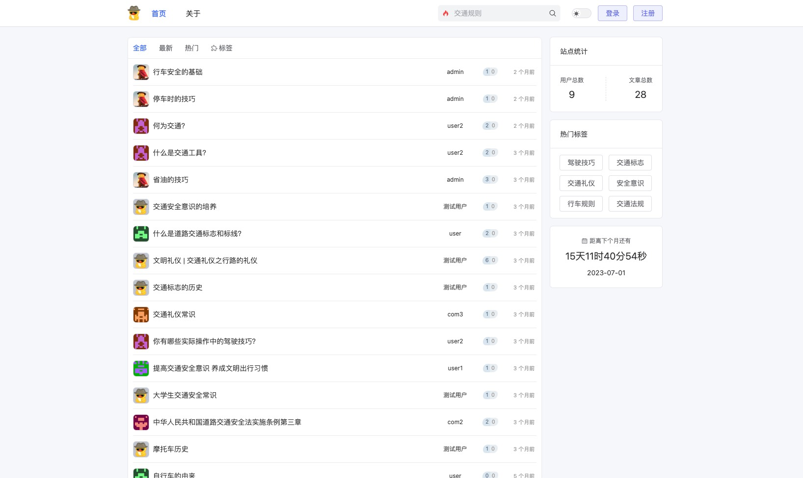

----

##### 2⃣️️ &nbsp;登录页

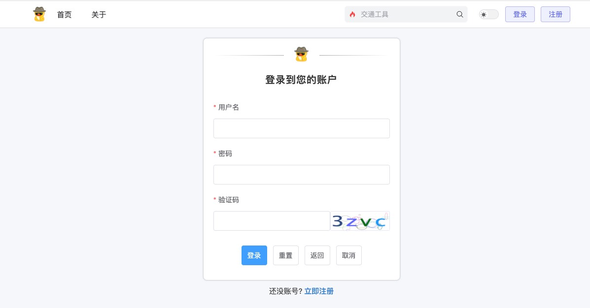

----

##### 3⃣️ &nbsp;帖子详情页

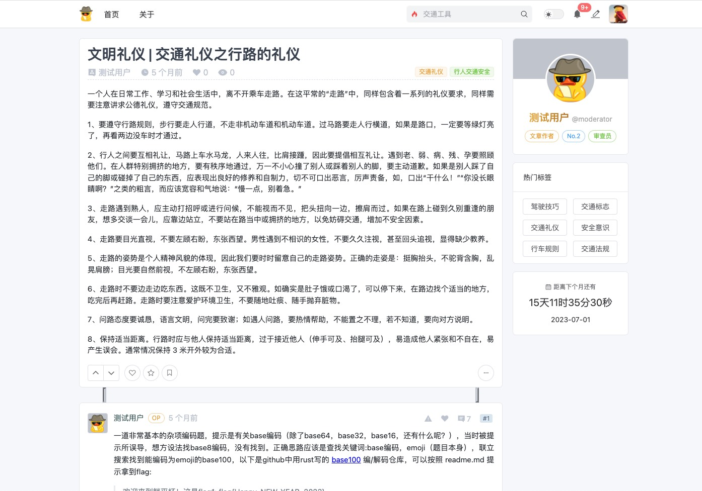

----

##### 4⃣️️ &nbsp;楼中楼回复

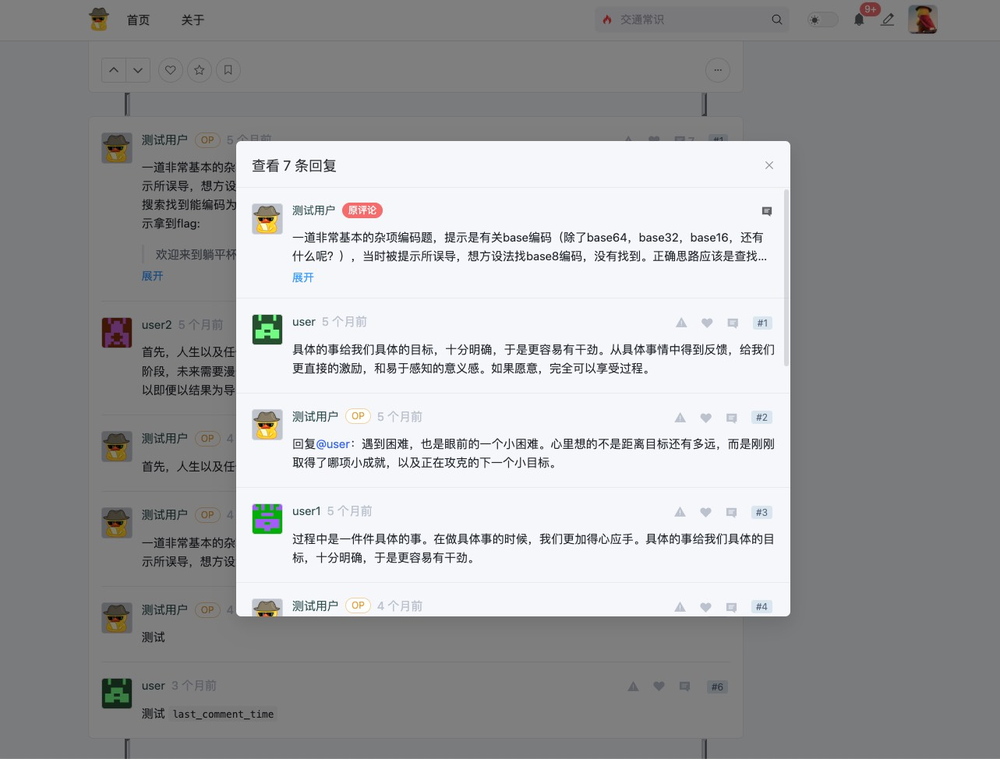

----

##### 5⃣️️️ &nbsp;个人中心

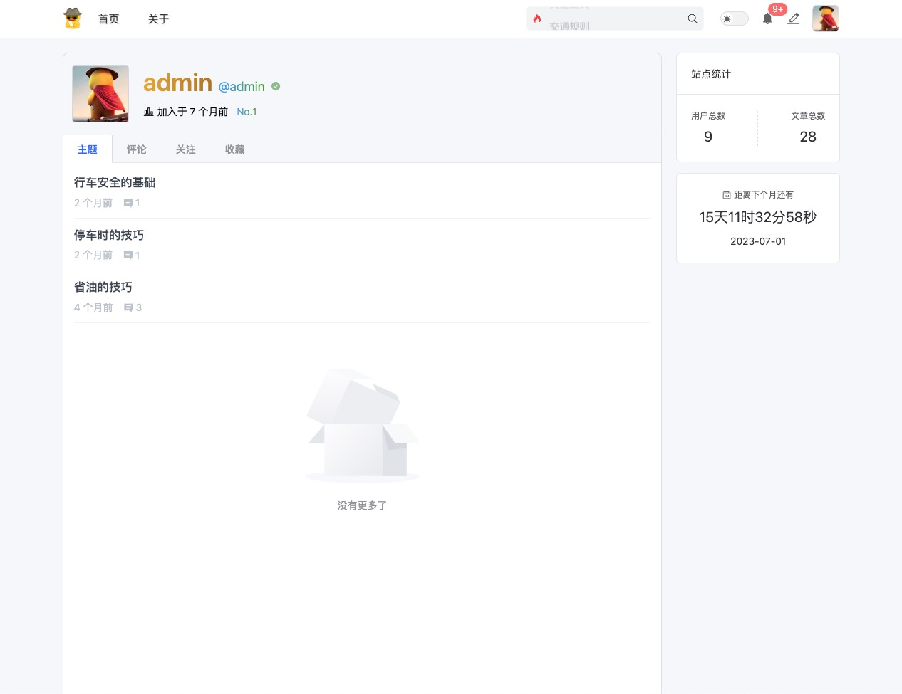

----

##### 6⃣️️️️ &nbsp;修改头像


----

##### 7⃣️️️️️ &nbsp;搜索

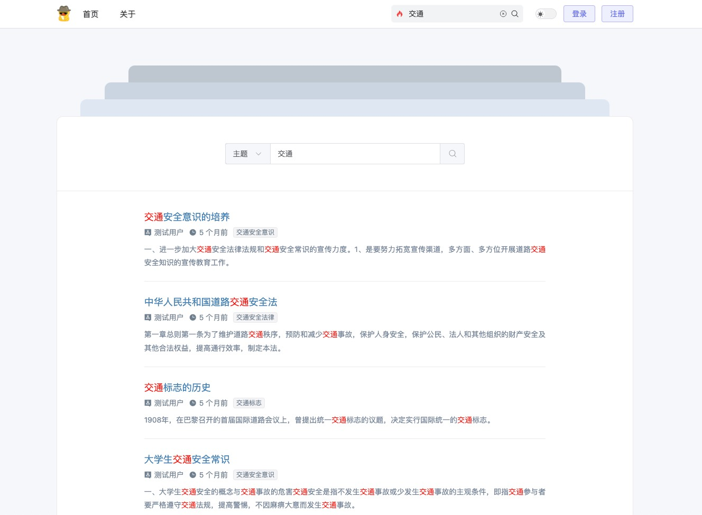

----

##### 8⃣️️️️️ &nbsp;标签页

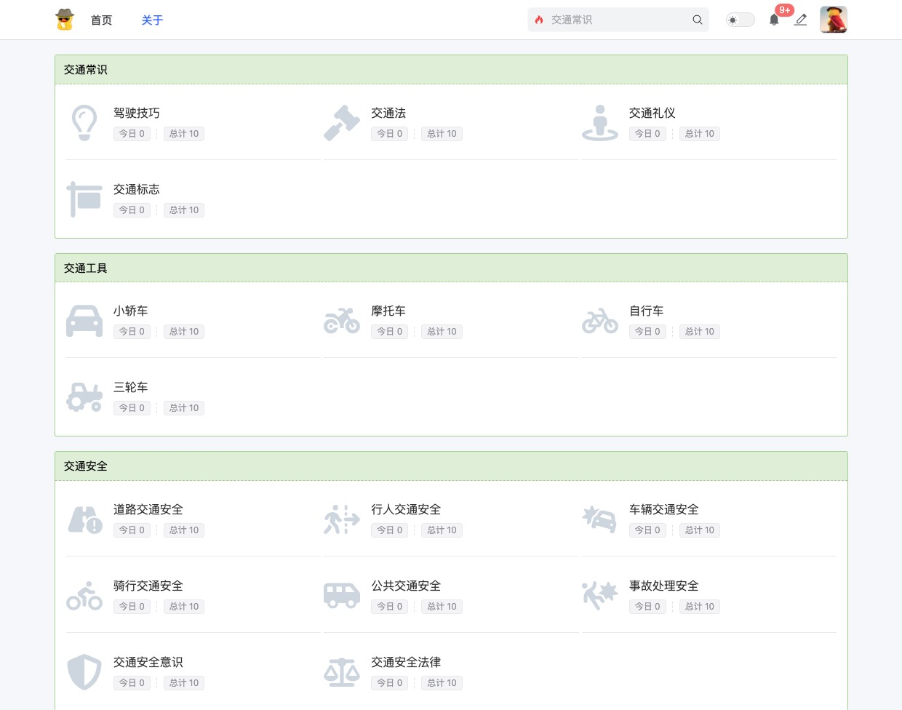

----

##### 9⃣️️️️️️ &nbsp;帖子发布页

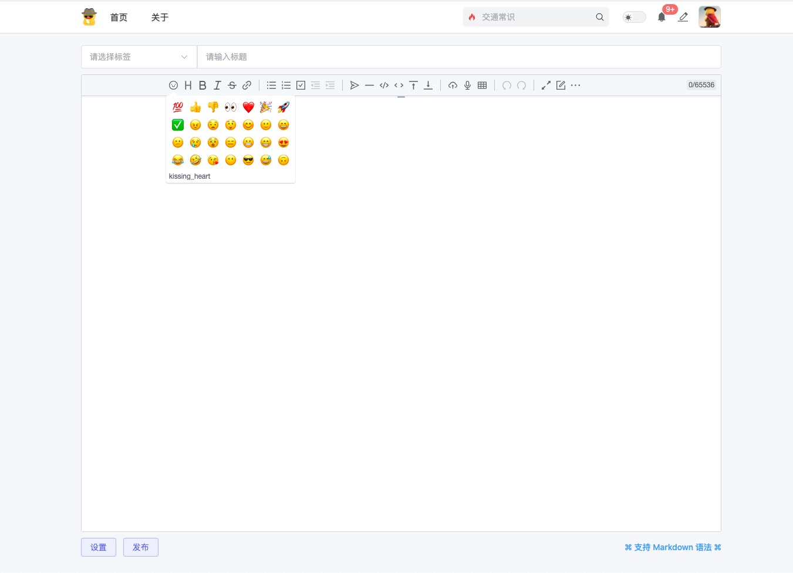

----

##### 1⃣️0⃣️ &nbsp;抽屉编辑器

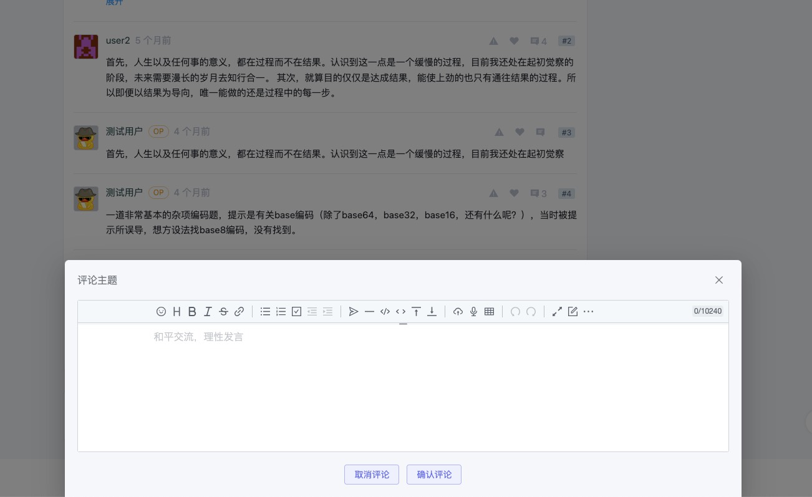

----

##### 1⃣️1⃣️️️️️️️ &nbsp;后台管理

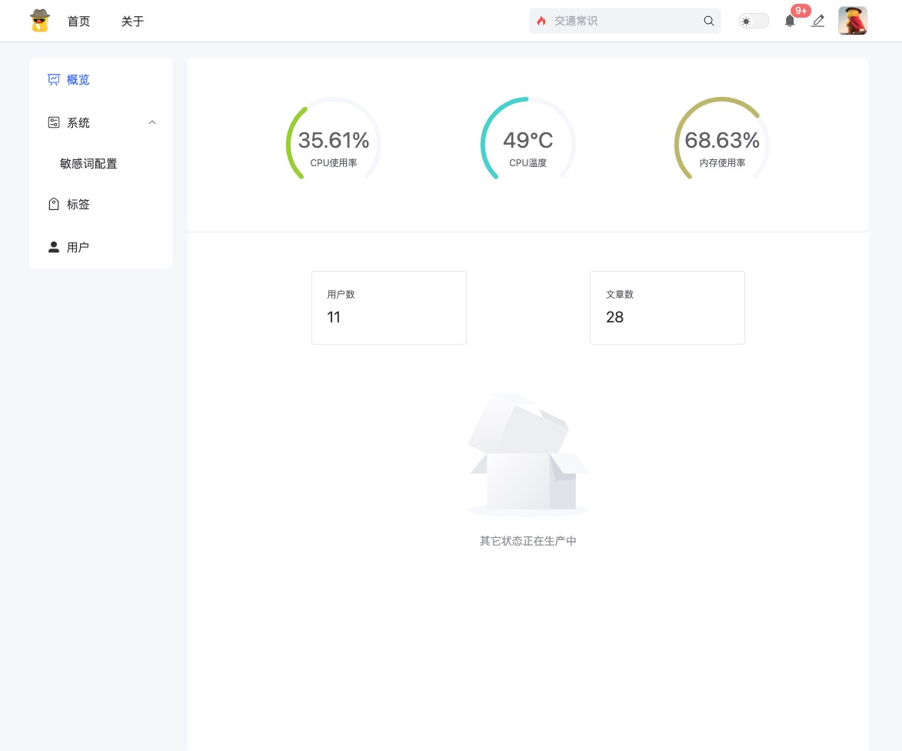

----

##### 1⃣️2⃣️️️️️️ &nbsp;暗黑模式

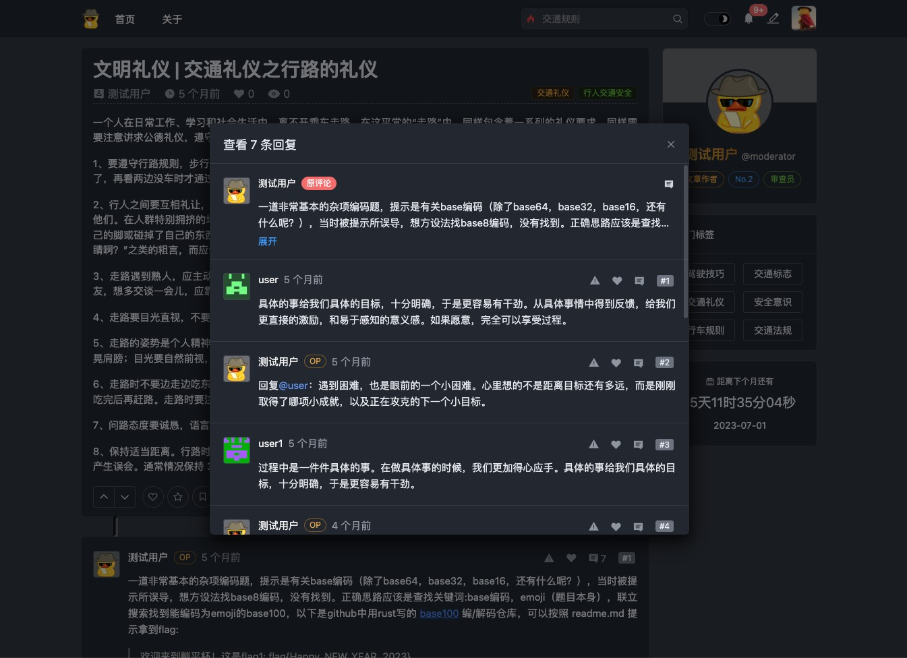

----

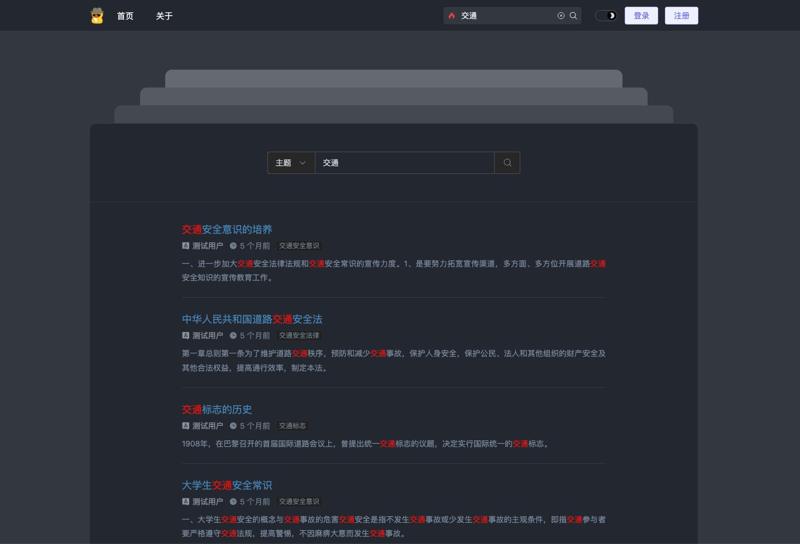

----


